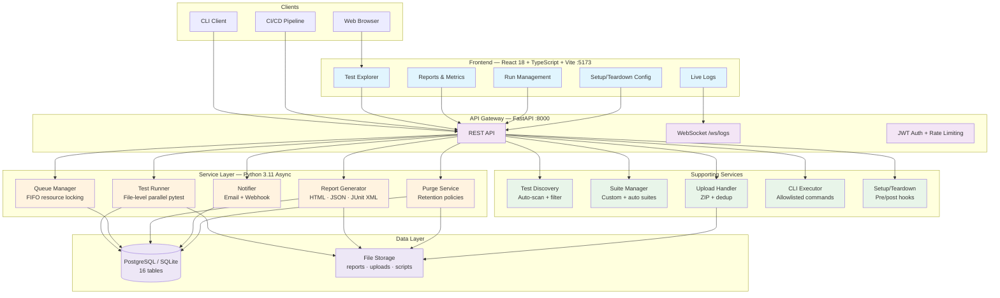

# Distributed Verification Platform

[](https://opensource.org/licenses/MIT)
[](https://www.python.org/downloads/)
[](https://nodejs.org/)
[](https://fastapi.tiangolo.com/)
[](https://reactjs.org/)

A comprehensive web-based test automation platform with distributed execution, real-time monitoring, and advanced reporting capabilities.

## Table of Contents

- [Features](#features)
- [Architecture](#architecture)
- [Quick Start](#quick-start)
- [API Documentation](#api-documentation)
- [Development](#development)
- [Deployment](#deployment)
- [Contributing](#contributing)
- [License](#license)
- [Support](#support)
- [Project Structure](#project-structure)
- [Missing (Optional but Recommended)](#missing-optional-but-recommended)
- React frontend for test selection, logs, and summaries
- FastAPI backend with async orchestration
- Pytest test execution and result capture
- PostgreSQL-compatible centralized storage
- Multi-client concurrent request handling with resource queueing
- Real-time log streaming via WebSockets
- Advanced test discovery with filtering
- Run history and client management UI
- Docker deployment support
- JWT-based authentication
- Advanced run filtering
- CI/CD with GitHub Actions
- **Email and webhook notifications for run completion**
- **Metrics dashboard with system statistics**
- **Kubernetes deployment manifests**

## Features

### Core Functionality
- **Test Selection**: Browse and select tests from discovered pytest test files
- **Parallel Execution**: Run multiple tests concurrently with configurable parallelism
- **Resource Queueing**: Handle multiple clients accessing shared resources with intelligent queuing
- **Real-time Logs**: Stream test execution logs in real-time via WebSocket connections
- **Centralized Storage**: Store all test runs, logs, and client data in PostgreSQL

### Management & Monitoring
- **Run History**: View past test runs with filtering by status, test name, and date
- **Client Management**: Register and manage multiple test clients
- **Queue Monitoring**: View current queue status for resource-constrained tests
- **Metrics Dashboard**: System statistics including success rates, client activity, and resource utilization

### Notifications
- **Email Notifications**: Automatic email alerts for run completion (configurable per client)
- **Webhook Notifications**: HTTP webhook callbacks for integration with external systems

### Deployment
- **Docker Support**: Complete containerization with docker-compose for local development
- **Kubernetes**: Production-ready K8s manifests with ingress, secrets, and persistent storage
- **CI/CD**: Automated testing and building with GitHub Actions

## Architecture

### System Architecture Overview



> **Detailed architecture** with sequence diagrams: see [docs/ARCHITECTURE.md](docs/ARCHITECTURE.md)

## Requirements

- **Python** >= 3.11
- **Node.js** >= 18
- **PostgreSQL** (production) or SQLite (local development)
- **Docker** (optional, for containerized deployment)

For complete dependency lists, see:
- Backend: [backend/pyproject.toml](backend/pyproject.toml)
- Frontend: [frontend/package.json](frontend/package.json)

Dependency updates are automated with GitHub Dependabot using `.github/dependabot.yml`.

## Quick Start

### Backend

1. Install dependencies:
   ```powershell
   cd backend
   pip install -U pip
   python -m pip install -e .
   ```
2. Create or update `backend/.env` with a valid `DATABASE_URL`.
3. Start the backend server:
   ```powershell
   cd backend
   .venv\Scripts\activate
   python -m uvicorn app.main:app --reload --host 0.0.0.0 --port 8000
   ```

### Frontend

1. Install dependencies:
   ```powershell
   cd frontend
   npm install
   ```
2. Start the client:
   ```powershell
   npm run dev -- --host 0.0.0.0 --port 5173
   ```

### HTTPS / SSL Certificates (Optional)

The Vite dev server automatically serves **HTTPS** when cert files exist at `certs/cert.pem` and `certs/key.pem` in the project root. If no certs are found, it falls back to plain HTTP.

> **Symptom**: `ERR_SSL_PROTOCOL_ERROR` when accessing via LAN IP (e.g. `https://192.168.1.6:5173`).
> **Cause**: Either no certs exist, or the certificate's Subject Alternative Names (SANs) don't include your IP.

**Generate a self-signed dev certificate (Windows PowerShell):**

```powershell
# 1. Create a cert with SANs for localhost + your LAN IP
$cert = New-SelfSignedCertificate `
    -Subject "CN=DVP Dev" `
    -TextExtension @("2.5.29.17={text}DNS=localhost&IPAddress=192.168.1.6&IPAddress=127.0.0.1") `
    -CertStoreLocation "Cert:\CurrentUser\My" `
    -NotAfter (Get-Date).AddYears(2) `
    -KeyAlgorithm RSA -KeyLength 2048 -HashAlgorithm SHA256 `
    -KeyExportPolicy Exportable

# 2. Export as PFX (temporary)
$pwd = ConvertTo-SecureString -String "temp" -Force -AsPlainText
Export-PfxCertificate -Cert $cert -FilePath certs/temp.pfx -Password $pwd | Out-Null

# 3. Convert PFX → PEM using Python (cryptography is in backend deps)
cd backend
.venv/Scripts/python -c "
from cryptography.hazmat.primitives.serialization import pkcs12, Encoding, PrivateFormat, NoEncryption
from pathlib import Path
pfx = Path('../certs/temp.pfx').read_bytes()
key, cert, _ = pkcs12.load_key_and_certificates(pfx, b'temp')
Path('../certs/key.pem').write_bytes(key.private_bytes(Encoding.PEM, PrivateFormat.PKCS8, NoEncryption()))
Path('../certs/cert.pem').write_bytes(cert.public_bytes(Encoding.PEM))
Path('../certs/temp.pfx').unlink()
print('Done — certs/cert.pem + certs/key.pem written')
"

# 4. Clean up cert from Windows store
Remove-Item "Cert:\CurrentUser\My\$($cert.Thumbprint)"
```

**Generate using OpenSSL (Linux/macOS):**

```bash
openssl req -x509 -newkey rsa:2048 -nodes -days 730 \
  -keyout certs/key.pem -out certs/cert.pem \
  -subj "/CN=DVP Dev" \
  -addext "subjectAltName=DNS:localhost,IP:192.168.1.6,IP:127.0.0.1"
```

> **Note**: Replace `192.168.1.6` with your actual LAN IP. Certs are gitignored — each developer generates their own. On first browser visit, accept the self-signed cert warning (Advanced → Proceed).

### Using Docker Compose

```powershell
docker compose up --build
```

## API Documentation

Once the backend is running, visit:
- **Swagger UI**: http://localhost:8000/docs
- **ReDoc**: http://localhost:8000/redoc
- **OpenAPI Schema**: http://localhost:8000/openapi.json

### Key Endpoints

- `POST /clients/register` - Register a new client
- `GET /tests/discover` - Discover available tests
- `POST /runs` - Start a new test run
- `GET /runs/{id}/logs` - Get real-time logs for a run
- `GET /runs/{id}/reports/{type}` - Get generated reports
- `GET /metrics` - Get system metrics

## Development

### Prerequisites

- Python 3.11+
- Node.js 18+
- PostgreSQL (optional, defaults to SQLite)

### Backend Development

```bash
cd backend
python -m venv .venv
source .venv/bin/activate  # On Windows: .venv\Scripts\activate
pip install -e .
cp .env.example .env  # Configure your settings
python -m uvicorn app.main:app --reload --host 0.0.0.0 --port 8000
```

### Frontend Development

```bash
cd frontend
npm install
npm run dev -- --host 0.0.0.0 --port 5173
```

### Testing

```bash
# Backend tests
cd backend
pytest tests/ -v

# Frontend tests
cd frontend
npm test
```

## Deployment

1. Build and push Docker images:
   ```bash
   docker build -t dvp-backend:latest ./backend
   docker build -t dvp-frontend:latest ./frontend
   docker push dvp-backend:latest
   docker push dvp-frontend:latest
   ```

2. Update SMTP credentials in `k8s/smtp-secret.yaml`

3. Deploy to Kubernetes:
   ```bash
   kubectl apply -k k8s/
   ```

## Contributing

1. Fork the repository
2. Create a feature branch: `git checkout -b feature/amazing-feature`
3. Commit your changes: `git commit -m 'Add amazing feature'`
4. Push to the branch: `git push origin feature/amazing-feature`
5. Open a Pull Request

### Development Guidelines

- Follow PEP 8 for Python code
- Use TypeScript strict mode for frontend code
- Write tests for new features
- Update documentation as needed
- Ensure all tests pass before submitting PR

## License

This project is licensed under the MIT License - see the [LICENSE](LICENSE) file for details.

## Support

For questions or issues:
- Create an issue on GitHub
- Check the documentation in the `docs/` directory
- Review the API documentation at `/docs` when running locally

## Project Structure

- `backend/app` — FastAPI app, SQLAlchemy models, service layer
- `frontend/src` — React + TypeScript UI (test selection, run status, logs, reports)
- `tests/` — pytest test suites for discovery and execution
- `docs/` — Architecture, requirements, and user guide
- `k8s/` — Kubernetes deployment manifests
- `setup_scripts/` — Pre-run environment checks and validation
- `teardown_scripts/` — Post-run cleanup and archival

