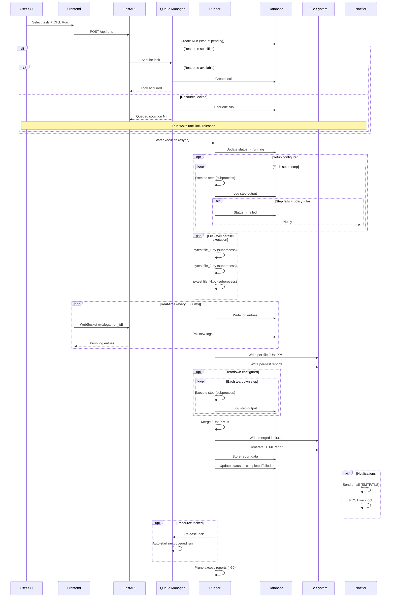
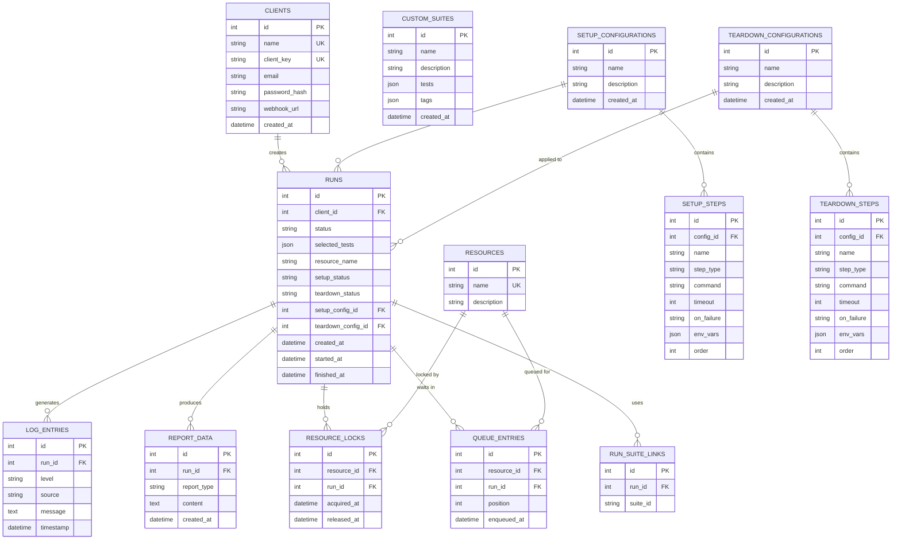
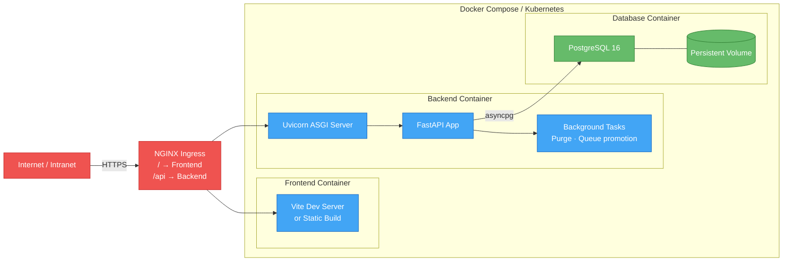

# DVP — Architecture

**Distributed Verification Platform**

---

## System Architecture Diagram

```mermaid
graph TB
    subgraph "Client Layer"
        Browser["🌐 Web Browser<br/>(React 18 + TypeScript + Vite)"]
        CLI["⌨️ CLI Tool<br/>(Click + Rich)"]
        CICD["🔄 CI/CD Pipeline<br/>(REST API / CLI)"]
    end

    subgraph "Frontend Application"
        direction TB
        AppShell["App Shell<br/>Theme · ErrorModal · HealthCheck"]
        Sidebar["Sidebar<br/>Registration · Explorer Tabs · Run Controls"]
        Dashboard["Dashboard<br/>RunDetail · Metrics · Results · Reports"]
        
        subgraph "Explorer Panels"
            TestExplorer["Test Explorer"]
            SuitesPanel["Suites Panel"]
            SetupPanel["Setup Panel"]
            TeardownPanel["Teardown Panel"]
            UploadPanel["Upload Panel"]
            CliPanel["CLI Panel"]
        end

        subgraph "Hooks Layer"
            useClient["useClientRegistration"]
            useRun["useRunManagement"]
            usePoll["useRunPolling"]
            useTests["useTestManagement"]
            useTabs["useTabManagement"]
        end
    end

    subgraph "API Gateway"
        FastAPI["FastAPI Application<br/>CORS · Rate Limiting · Size Limits"]
        
        subgraph "Endpoints"
            AuthAPI["Auth API<br/>JWT · Login · Admin Key"]
            ClientAPI["Client API<br/>Register · List"]
            RunAPI["Run API<br/>Create · Cancel · Status · Logs"]
            TestAPI["Test API<br/>Discover · Upload"]
            SuiteAPI["Suite API<br/>Auto · Marker · Custom CRUD"]
            ReportAPI["Report API<br/>HTML · JSON · XML · Download"]
            MetricsAPI["Metrics API<br/>Dashboard Stats"]
            ResourceAPI["Resource API<br/>Create · Queue · Lock"]
            SetupAPI["Setup/Teardown API<br/>Config CRUD · Scripts"]
            AdminAPI["Admin API<br/>Purge · Cleanup"]
        end
        
        WS["WebSocket<br/>/ws/logs/{run_id}"]
    end

    subgraph "Service Layer"
        Runner["Test Runner<br/>File-level parallel pytest<br/>subprocess management<br/>stdout/stderr capture"]
        ReportGen["Report Generator<br/>HTML · JSON · JUnit merge<br/>Coverage · Allure<br/>Per-test · Per-file"]
        Queue["Resource Queue Manager<br/>Exclusive locking<br/>Position tracking<br/>Auto-promotion"]
        Notifier["Notification Service<br/>Email (SMTP/TLS)<br/>Webhook (HTTP POST)"]
        Purge["Purge Service<br/>Time-based retention<br/>Count-based pruning<br/>Periodic background task"]
    end

    subgraph "Data Layer"
        subgraph "Database"
            SQLite["SQLite + aiosqlite<br/>(Development)"]
            PostgreSQL["PostgreSQL + asyncpg<br/>(Production)"]
        end
        ORM["SQLAlchemy 2.0 Async ORM<br/>13 Tables · Auto-migration"]
        
        subgraph "File Storage"
            Reports["reports/{run_id}/<br/>junit.xml · report.html<br/>report.json · tests/ · files/"]
            Uploads["data/uploads/{client_key}/<br/>Uploaded test archives"]
            Scripts["setup_scripts/ · teardown_scripts/<br/>Pre-defined automation scripts"]
        end
    end

    %% Client to Frontend
    Browser -->|HTTP/HTTPS| AppShell
    CLI -->|HTTP| FastAPI
    CICD -->|HTTP| FastAPI

    %% Frontend internal
    AppShell --> Sidebar
    AppShell --> Dashboard
    Sidebar --> TestExplorer & SuitesPanel & SetupPanel & TeardownPanel & UploadPanel & CliPanel
    Dashboard --> usePoll
    Sidebar --> useClient & useRun & useTests & useTabs

    %% Frontend to API
    useClient -->|REST| ClientAPI
    useRun -->|REST| RunAPI
    useTests -->|REST| TestAPI & SuiteAPI
    usePoll -->|WebSocket| WS
    usePoll -->|REST fallback| RunAPI

    %% API to Services
    RunAPI --> Runner
    RunAPI --> Queue
    ReportAPI --> ReportGen
    AdminAPI --> Purge
    Runner --> ReportGen
    Runner --> Notifier
    Runner --> Queue
    
    %% Services to Data
    Runner --> ORM
    Runner --> Reports
    ReportGen --> ORM
    ReportGen --> Reports
    Queue --> ORM
    Notifier --> ORM
    Purge --> ORM
    Purge --> Reports
    TestAPI --> Uploads
    SetupAPI --> Scripts
    ORM --> SQLite
    ORM --> PostgreSQL

    %% Styling
    classDef client fill:#4A90D9,stroke:#2C5F8A,color:#fff
    classDef frontend fill:#61DAFB,stroke:#3BA5C9,color:#000
    classDef api fill:#009688,stroke:#00695C,color:#fff
    classDef service fill:#FF9800,stroke:#E65100,color:#000
    classDef data fill:#8BC34A,stroke:#558B2F,color:#000
    classDef ws fill:#E91E63,stroke:#AD1457,color:#fff

    class Browser,CLI,CICD client
    class AppShell,Sidebar,Dashboard,TestExplorer,SuitesPanel,SetupPanel,TeardownPanel,UploadPanel,CliPanel,useClient,useRun,usePoll,useTests,useTabs frontend
    class FastAPI,AuthAPI,ClientAPI,RunAPI,TestAPI,SuiteAPI,ReportAPI,MetricsAPI,ResourceAPI,SetupAPI,AdminAPI api
    class WS ws
    class Runner,ReportGen,Queue,Notifier,Purge service
    class SQLite,PostgreSQL,ORM,Reports,Uploads,Scripts data
```

---

## Run Execution Flow

```mermaid
sequenceDiagram
    participant U as User / CI
    participant FE as Frontend
    participant API as FastAPI
    participant Q as Queue Manager
    participant R as Runner
    participant DB as Database
    participant FS as File System
    participant N as Notifier

    U->>FE: Select tests + Click Run
    FE->>API: POST /api/runs
    API->>DB: Create Run (status: pending)
    
    alt Resource specified
        API->>Q: Acquire lock
        alt Resource available
            Q->>DB: Create lock
            Q-->>API: Lock acquired
        else Resource locked
            Q->>DB: Enqueue run
            Q-->>API: Queued (position N)
            Note over U,N: Run waits until lock released
        end
    end

    API->>R: Start execution (async)
    R->>DB: Update status → running

    opt Setup configured
        loop Each setup step
            R->>R: Execute step (subprocess)
            R->>DB: Log step output
            alt Step fails + policy = fail
                R->>DB: Status → failed
                R-->>N: Notify
            end
        end
    end

    par File-level parallel execution
        R->>R: pytest file_1.py (subprocess)
        R->>R: pytest file_2.py (subprocess)
        R->>R: pytest file_N.py (subprocess)
    end

    loop Real-time (every ~300ms)
        R->>DB: Write log entries
        FE->>API: WebSocket /ws/logs/{run_id}
        API->>DB: Poll new logs
        API-->>FE: Push log entries
    end

    R->>FS: Write per-file JUnit XML
    R->>FS: Write per-test reports

    opt Teardown configured
        loop Each teardown step
            R->>R: Execute step (subprocess)
            R->>DB: Log step output
        end
    end

    R->>R: Merge JUnit XMLs
    R->>FS: Write merged junit.xml
    R->>FS: Generate HTML report
    R->>DB: Store report data
    R->>DB: Update status → completed/failed

    par Notifications
        N->>N: Send email (SMTP/TLS)
        N->>N: POST webhook
    end

    opt Resource locked
        R->>Q: Release lock
        Q->>Q: Auto-start next queued run
    end

    R->>R: Prune excess reports (>50)
```

---

## Data Model

```mermaid
erDiagram
    CLIENTS {
        int id PK
        string name UK
        string client_key UK
        string email
        string password_hash
        string webhook_url
        datetime created_at
    }

    RUNS {
        int id PK
        int client_id FK
        string status
        json selected_tests
        string resource_name
        string setup_status
        string teardown_status
        int setup_config_id FK
        int teardown_config_id FK
        datetime created_at
        datetime started_at
        datetime finished_at
    }

    LOG_ENTRIES {
        int id PK
        int run_id FK
        string level
        string source
        text message
        datetime timestamp
    }

    REPORT_DATA {
        int id PK
        int run_id FK
        string report_type
        text content
        datetime created_at
    }

    RESOURCES {
        int id PK
        string name UK
        string description
    }

    RESOURCE_LOCKS {
        int id PK
        int resource_id FK
        int run_id FK
        datetime acquired_at
        datetime released_at
    }

    QUEUE_ENTRIES {
        int id PK
        int resource_id FK
        int run_id FK
        int position
        datetime enqueued_at
    }

    CUSTOM_SUITES {
        int id PK
        string name
        string description
        json tests
        json tags
        datetime created_at
    }

    RUN_SUITE_LINKS {
        int id PK
        int run_id FK
        string suite_id
    }

    SETUP_CONFIGURATIONS {
        int id PK
        string name
        string description
        datetime created_at
    }

    SETUP_STEPS {
        int id PK
        int config_id FK
        string name
        string step_type
        string command
        int timeout
        string on_failure
        json env_vars
        int order
    }

    TEARDOWN_CONFIGURATIONS {
        int id PK
        string name
        string description
        datetime created_at
    }

    TEARDOWN_STEPS {
        int id PK
        int config_id FK
        string name
        string step_type
        string command
        int timeout
        string on_failure
        json env_vars
        int order
    }

    CLIENTS ||--o{ RUNS : "creates"
    RUNS ||--o{ LOG_ENTRIES : "generates"
    RUNS ||--o{ REPORT_DATA : "produces"
    RUNS ||--o{ RESOURCE_LOCKS : "holds"
    RUNS ||--o{ QUEUE_ENTRIES : "waits in"
    RUNS ||--o{ RUN_SUITE_LINKS : "uses"
    RESOURCES ||--o{ RESOURCE_LOCKS : "locked by"
    RESOURCES ||--o{ QUEUE_ENTRIES : "queued for"
    SETUP_CONFIGURATIONS ||--o{ SETUP_STEPS : "contains"
    TEARDOWN_CONFIGURATIONS ||--o{ TEARDOWN_STEPS : "contains"
    SETUP_CONFIGURATIONS ||--o{ RUNS : "applied to"
    TEARDOWN_CONFIGURATIONS ||--o{ RUNS : "applied to"
```

---

## Deployment Topology

```mermaid
graph LR
    subgraph "Docker Compose / Kubernetes"
        subgraph "Frontend Container"
            Vite["Vite Dev Server<br/>or Static Build"]
        end

        subgraph "Backend Container"
            Uvicorn["Uvicorn ASGI Server"]
            FastAPI2["FastAPI App"]
            BgTasks["Background Tasks<br/>Purge · Queue promotion"]
        end

        subgraph "Database Container"
            PG["PostgreSQL 16"]
            PGData[("Persistent Volume")]
        end
    end

    Internet["Internet / Intranet"] -->|HTTPS| Ingress["NGINX Ingress<br/>/ → Frontend<br/>/api → Backend"]
    Ingress --> Vite
    Ingress --> Uvicorn
    Uvicorn --> FastAPI2
    FastAPI2 --> BgTasks
    FastAPI2 -->|asyncpg| PG
    PG --- PGData

    classDef container fill:#42A5F5,stroke:#1565C0,color:#fff
    classDef db fill:#66BB6A,stroke:#2E7D32,color:#fff
    classDef ext fill:#EF5350,stroke:#C62828,color:#fff

    class Vite,Uvicorn,FastAPI2,BgTasks container
    class PG,PGData db
    class Internet,Ingress ext
```
